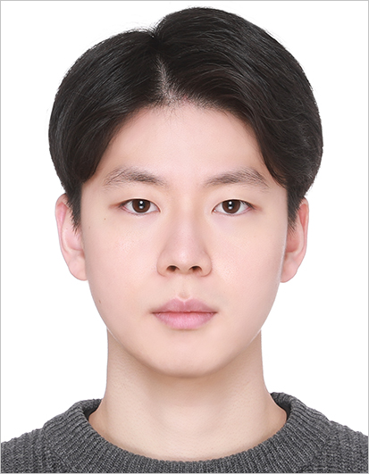

# Kim HanBeul

## Introduction
Hi' I'm HanBeul Kim, bachelor/master course student in **IISLAB@SKKU** South Korea.\
My research topic is **Recommendation System** and I'm especially \
interested in **Multi-Behavior Sequential Recommendation System (MBSR)**.

## Education
* **SungKyunKwan University(SKKU)**, South Korea\
**M.S.**, Artificial Intellegence, 2023 ~
* **SungKyunKwan University(SKKU)**, South Korea\
**B.S.**, Software Department, 2017 ~ 2023

## Achievements and Certifications

> ## Achievements
>> #### 2022년 학부 PBL 교과목 프로젝트 공모전 (2022.01.7)
>> Role : Backend / Collection and refinement of data
>> * 1st Award
>> * Team : 4 participants
>> * Construct Database of clinical triasl and doctor information
>> * Development of algorithm for searching doctor by english name and vice versa
>>
>> #### 2022년 학부 PBL 교과목 프로젝트 공모전 (202211.14 ~ 2022.12.11)
>> Role : Backend / Collection and refinement of data
>> * 1st Award
>> * Weekly workout scheduler and workout performance analyze

> ## Certifications
>> ### TOEIC
>> * Score : 840/990
>> * Acquistion data : 2019.12.14 (Expired)
>> 
>> ### HSK
>> * Score : 212/300
>> * Acquistion date : 2017.10 (Expired)

## Contact
Email : hanbeul2@g.skku.edu \
[Google] Github link : https://github.com/KimHanBeul?tab=repositories

